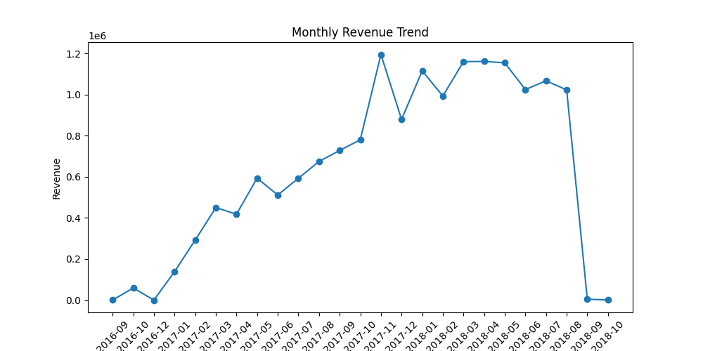
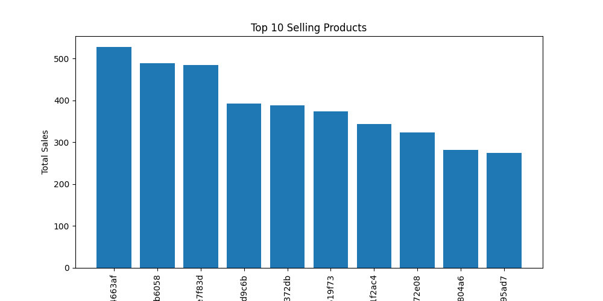
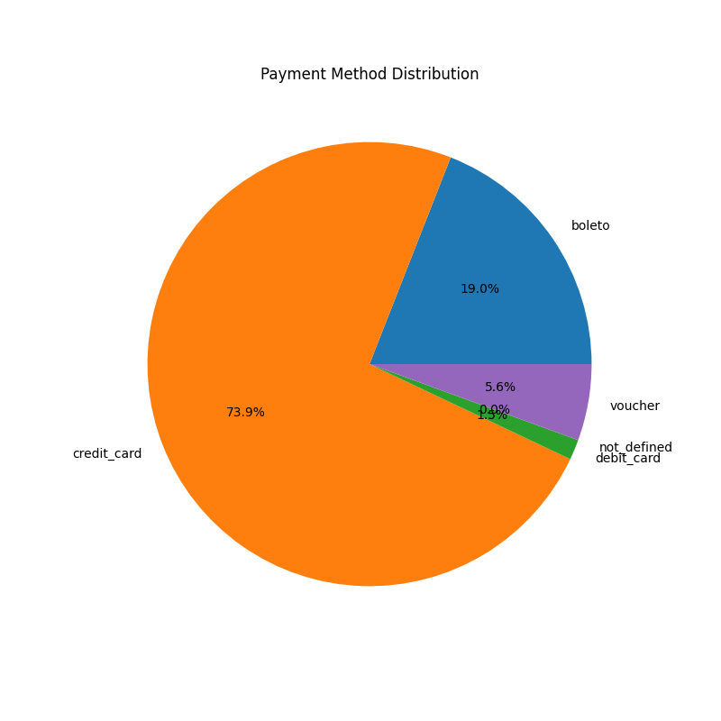
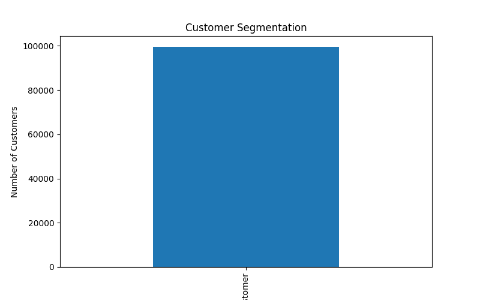

# Global E-Commerce Sales Data Analysis Platform

## Project Overview

This project analyzes a global e-commerce dataset to generate business insights such as revenue trends, customer behavior, product performance, and payment patterns.

The goal of this project is to simulate a real-world **data analytics pipeline** using Python, SQL, and data visualization.

---

## Tech Stack

- Python
- Pandas
- SQLite
- Matplotlib
- Jupyter Notebook

---

## Project Architecture

Data Source (CSV Files)
        │
        ▼
Data Cleaning & Processing (Python + Pandas)
        │
        ▼
Database Storage (SQLite)
        │
        ▼
Business Analysis (SQL Queries)
        │
        ▼
Data Visualization (Matplotlib)
        │
        ▼
Insights Dashboard

---

## Dataset

The dataset contains information about:

- Customers
- Orders
- Order Items
- Products
- Payments

Source: Brazilian E-Commerce Public Dataset

---

## Key Business Insights

### 1 Revenue Trend Analysis

Tracks how total sales revenue changes over time to identify growth patterns.



---

### 2 Top 10 Best Selling Products

Identifies the most frequently purchased products.



---

### 3 Payment Method Distribution

Shows which payment methods customers prefer.



---

### 4 Customer Segmentation

Customers are categorized into:

- New Customers
- Regular Customers
- Loyal Customers



---

## Business Questions Answered

1. What is the monthly revenue trend?
2. Which products generate the most sales?
3. Which payment methods are most used?
4. How many repeat customers do we have?
5. What percentage of customers are loyal?

---

## How to Run the Project

Clone the repository:

```bash
git clone https://github.com/Babajan03/Global-E-Commerce-Sales-Data-Analysis-Platform.git